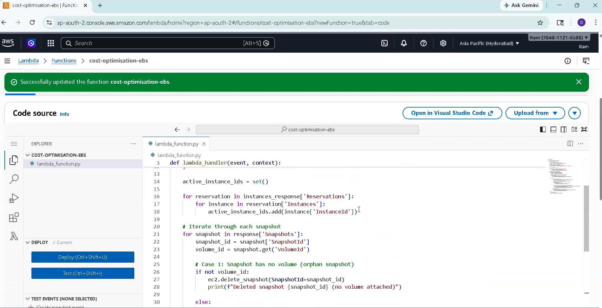
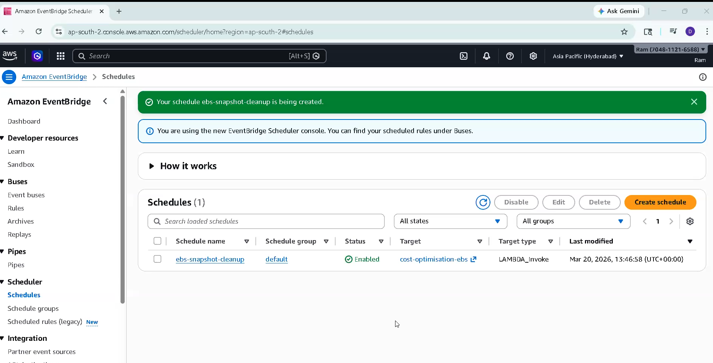
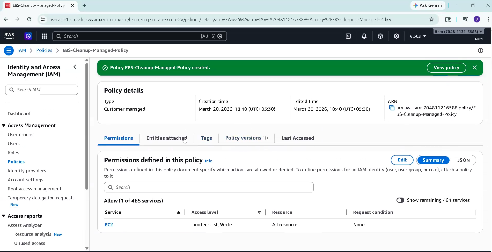

# EBS Snapshot Cleanup Automation (AWS)

## 📌 Project Overview
This project automatically deletes unused EBS snapshots using AWS Lambda and EventBridge.

## 🚀 Architecture
EventBridge Scheduler → Lambda → EC2 Snapshots → CloudWatch Logs

## 🧠 Features
- Deletes unused EBS snapshots
- Runs automatically (daily)
- Cost optimization
- Serverless architecture

## ⚙️ Services Used
- AWS Lambda
- EventBridge Scheduler
- EC2 (Snapshots)
- CloudWatch
- IAM

## 🔐 IAM Permissions
- ec2:DescribeSnapshots
- ec2:DescribeInstances
- ec2:DescribeVolumes
- ec2:DeleteSnapshot

## ⏰ Schedule
Runs daily using EventBridge Scheduler.

## 💰 Cost Optimization
Removes unused snapshots to reduce AWS billing.

## 📸 Screenshots

### 🔹 Lambda Function

### 🔹 EventBridge Scheduler

### 🔹 IAM Role

